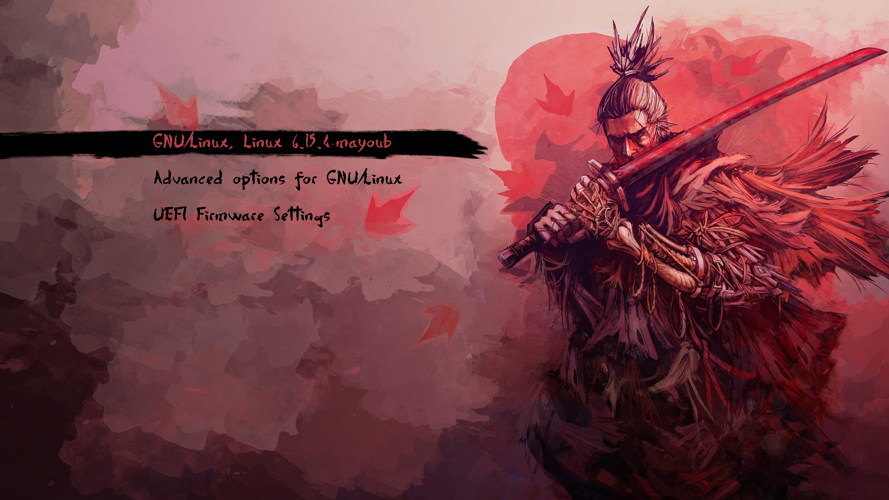
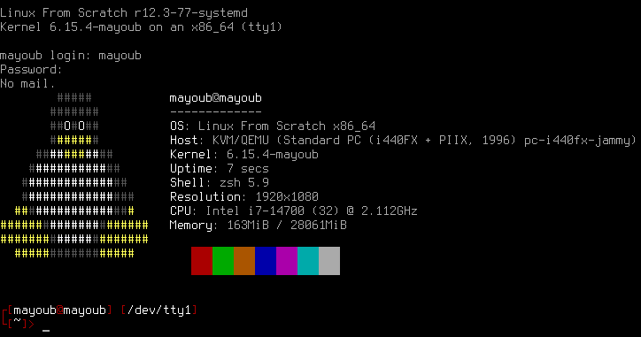

# ft_linux

## `ft_linux` is a 42's project that involves setting up a Linux environment from scratch, basically building a [_Linux From Scratch (LFS)_](https://www.linuxfromscratch.org/lfs/view/systemd/) system and configuring various components.

	

# What is a _Linux From Scratch_ system?

Linux From Scratch is a type of Linux system that is built from the ground up, allowing users to create a custom Linux distribution tailored to their specific needs, and it's also the name of the book of the person who created it, **Gerard Beekmans**. The book provides guidance on how to build your own Linux system from the ground up, including detailed instructions and explanations of the various components involved.

And the objective of `ft_linux` is to build a Linux system from scratch, following the steps outlined in the LFS book, and to configure various components such as the kernel, bootloader, and system libraries.

# Waste of time ?

Honestly, you NEVER use it in real life, but it's a good exercise to understand how a Linux system works. It's also a good way to learn about the various components of a Linux system, and how they interact with each other. You learn A LOT about the Linux system, and how to configure it. It's also a good way to learn about the various components of a Linux system, and how they interact with each other.

It's a really good project for enriching your knowledge of Linux, and it's also a good way to learn about the various components of a Linux system, and how they interact with each other. And at the end you find a pleasure to add more functionality to your system by following the sequel of the book, which is called [_Beyond Linux From Scratch (BLFS)_](https://www.linuxfromscratch.org/blfs/view/systemd/).

# Walkthrough

On the [wiki](https://github.com/Nimpoo/ft_linux/wiki) you can find my complete walkthrough of the project, with detailed explanations of each step and how to configure various components of the system. I begin the project by using the `BIOS firmware`, but at the end of the LFS book, I discover I can't set a theme to `GRUB` because it's a feature of `GRUB2` that is exclusive to `UEFI firmware`, so I switch to the `UEFI firmware`. So the walkthrough covers only the `UEFI firmware`, but you can easily adapt it to the `BIOS firmware`; it's easier to follow the steps in the book. And it's really a pain to switch from `BIOS` to `UEFI` at THE END of the project, so I recommend you to start with `UEFI` from the beginning if you want a `GRUB` theme, and begin with `BIOS` for a smoother experience.

# Before you start

I suggest you to make this project in a virtual machine, because it can be a bit tricky to set up, and you don't want to mess up your main system. I use `QEMU` on this purpose.

And obviously, keep the [LFS book](https://www.linuxfromscratch.org/lfs/view/systemd/) open in front of you.

# MADE BY ME

<table>
  <tr>
    <td align="center"><a href="https://github.com/nimpoo/"> <b>Nimpô (mayoub)</b></a> </td>
  </tr>
</table>

# Special thanks to :

<table>
  <tr>
    <td align="center"><a href="https://github.com/jbettini/"> <b>jbettini</b></a> </td>
    <td align="center"><a href="https://github.com/noalexan/"> <b>Noah (noalexan)</b></a> </td>
  </tr>
</table>
